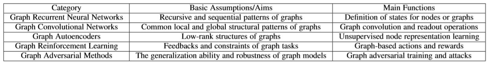

# Graph Neural Network
## LINK
* GNN
  * [GNNまとめ(1): GCNの導入](https://qiita.com/shionhonda/items/d27b8f13f7e9232a4ae5)
  * [グラフラプラシアンを噛み砕いて噛み砕いて跡形もなくしてみた](https://qiita.com/silva0215/items/0d1d25ef51b6865a6e15)
  * [NetworkのLaplacianについて](https://qiita.com/ryunryunryun/items/297b54a59172b43b3f20)
  * [グラフ畳み込みネットワークモデルを用いた化学構造への深層学習の適用](https://www.jstage.jst.go.jp/article/cicsj/36/2/36_27/_pdf)
  * [GCNs（Graph Convolutional Networks）とは](https://www.albert2005.co.jp/knowledge/machine_learning/deep_learning/about_gcns)
  * [グラフにまつわるサーベイまとめ](https://logmi.jp/tech/articles/321767)
  * [グラフィカルモデル解説](https://www.slideshare.net/Kawamoto_Kazuhiko/ss-35483453?next_slideshow=1)

## Memo
### Deep Learning on Graphs: A Survey
* Abstract
  * 画像や音声データと違って明確な構造を持たず、基本的な数学的操作をグラフに加えるのは難しい。
  * グラフ自体が、様々なタイプや特性を持っている。  
    タスクや特性ごとに、特定の問題を解くためのモデルアーキテクチャが要求される。
  * ドメイン特有の知識を活用することができる一方で、ドメイン知識を統合するとモデル設計が複雑になる可能性がある。
  * Deep Learningのグラフへの適用タスクは、以下の2種類に大別される。
    * Node-Focused tasks  
      個々のノードに関連付けられたタスクで、ノード分類やリンクの予測、ノードの推薦が挙げられる
    * Graph-focused tasks  
      グラフ全体に関連付けられたタスクで、グラフ分類やグラフの特性予測、グラフ生成が挙げられる。
   

   
* Graph Recurrent Neural Network
1. Node-level RNNs   
  * グラフの構造情報をエンコードするために、各ノード について低次元の状態ベクトルで表す。   
  * 状態ベクトルは再帰的に定義される。  
  * とが学習され、最終的なアウトプットとして以下が得られる。  
  * グラフベースなタスクにおいて、グラフ全体の潜在ベクトルを求めたい場合には、全ノードと隣接するマスターノードを加える。
  * 
   

